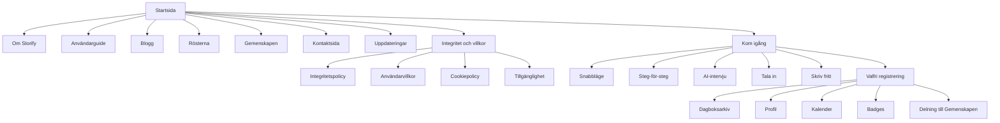
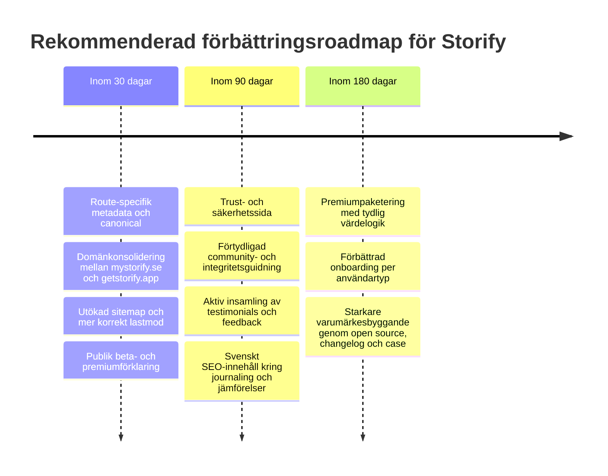

# Djupanalys av Mystorify.se

## Sammanfattning

Storify på mystorify.se är en svensk, webbaserad AI-dagbok som enligt den officiella sajten drivs av Johanna Fagerås. Produkten är gratis under beta, kräver ingen nedladdad app och beskriver sig som “helt på svenska”. Kärnerbjudandet är att sänka tröskeln för dagboksskrivande genom att låta användaren skriva, prata eller svara på frågor och sedan få en färdig dagbokstext tillbaka i en vald berättarröst. Officiellt lyfts fem lägen fram: AI‑intervju, Tala in, Snabbläge, steg‑för‑steg‑guide och Skriv fritt. Med konto får användaren arkiv, profilsynk, kalender, streaks och badges; utan konto lagras mycket lokalt i webbläsaren. Produkten har också en frivillig publik yta, Gemenskapen, där delade inlägg kan publiceras öppet. citeturn13search0turn13search1turn10search1turn51view0

Affärsmässigt framstår Storify som ett tidigt, founder-led projekt snarare än ett färdigpaketerat SaaS-bolag. Sajten beskriver det uttryckligen som ett hobbyprojekt, ett enmansprojekt och open source. Den publika affärsmodellen är i nuläget enkel: gratis under beta, med en möjlig framtida premium- eller betalmodell som ännu inte är prissatt offentligt. Samtidigt använder tjänsten betalningsdrivande tredjepartsinfrastruktur som Anthropic, OpenAI, Supabase, Render, Upstash, Resend och Google-tjänster, vilket gör att den nuvarande modellen sannolikt är bootstrapad eller subsidierad av grundaren. Det är inte en kritik; det är bara den ekonomiska fysiken bakom kulisserna. citeturn53view3turn13search3turn53view1turn5view4turn6view5turn18view7turn16view0

Det som sticker ut positivt är kombinationen av svensk språkdräkt, tydlig integritetskommunikation, låg friktion, PWA-stöd och en ovanligt lekfull produktdifferentiering genom många berättarröster. Storify är mindre “terapeut med generativ AI” och mer “skrivhjälp för vardagsminnen”, vilket är ett smart och relativt tydligt nischval. Det som håller tillbaka projektet är inte produkttanken utan främst marknadsmognad: begränsad extern social proof, otydlig framtida prisbild, tunnare varumärkesnärvaro utanför egna kanaler och flera tekniska SEO-frågor som sannolikt bromsar organisk synlighet. Särskilt viktigt är att den publika koden tyder på att title, description och canonical ligger på layoutnivå för hela sajten, medan jag inte hittar motsvarande sidspecifika head-taggar i /about eller /guide. Det gör att flera sidor sannolikt delar hemsidans metadata och canonical, vilket är ett klassiskt sätt att göra Google lite småsur. citeturn30view0turn37view0turn37view1turn37view3turn37view4turn16view0

På en övergripande skala bedömer jag därför Storify som **produktmässigt starkt men distributionsmässigt tidigt**. Kort sagt: en lovande produkt med mer själ än budget, mer transparens än polish, och betydligt bättre grundidé än nuvarande synlighet. Om SEO, domänstrategi, förtroendesign och paketering städas upp finns det en rimlig möjlighet att Storify kan ta en tydlig plats i nischen “svenskspråkig, integritetsmedveten AI‑journal för vanliga människor som aldrig lyckas hålla en dagbok”. citeturn13search0turn13search1turn52view0turn30view0turn19view0turn31view0

*Antaganden och luckor: den här rapporten bygger främst på mystorify.se, getstorify.app, officiella policyer, changelog, kontakt-/om-sidor, det publika GitHub-repot samt officiella konkurrentkällor. Jag har inte sett en offentlig, verifierbar PageSpeed-/CrUX-rapport för sajten i de källor som gick att nå här, så prestandabedömningen nedan är strukturell snarare än benchmark-baserad. Företagsformen framgår inte heller tydligt på sajten, även om ansvarig person och organisationsnummer anges offentligt. citeturn10search1turn13search3turn53view3turn16view0*

## Bolagsbild och kunder

Storify presenterar ingen tung corporate-berättelse, inget “vi revolutionerar marknaden”-pressmeddelande och inga fluffiga styrelserumsmoln. I stället säger sajten rakt ut att produkten drivs av Johanna Fagerås, att den är ett hobbyprojekt som vuxit fram ur ett personligt behov, och att det är ett enmansprojekt där meddelanden läses av “en faktisk människa”. Den sortens enkelhet är faktiskt en tillgång för ett tidigt konsumentverktyg i Sverige; den känns mer Göteborgsk verkstad än Silicon Valley-kostym, vilket i just den här kategorin är förtroendeskapande. Samtidigt betyder den personliga framtoningen att Storify ännu inte ser ut som ett skalbart “företag” i klassisk mening, utan snarare som ett tydligt produktprojekt med kommersiell potential. citeturn10search1turn13search3turn53view3

Någon formell mission statement finns inte i corporate-språk, men den produktmässiga missionen är glasklar: hjälpa människor som vill minnas sin vardag men inte har tid, energi eller skrivlust att faktiskt sätta sig och skriva. Startsidan riktar sig till dem som alltid tänker att de “borde” skriva dagbok men aldrig gör det, medan Om-sidan utvecklar samma idé med budskapet att verktyget ska passa dem som annars fastnar inför den blanka sidan. Bloggtexterna förstärker samma värdeerbjudande: specifika frågor, låg tröskel, kort insats, bättre minnesbevarande över tid. Det här är inte i första hand en terapeutisk journal, inte i första hand en produktivitetsdagbok och inte i första hand ett författarverktyg. Det är en vardagsnära minnesmotor. citeturn13search0turn13search1turn32search1turn32search10

Målgruppen verkar därför vara bred men ändå tydlig i beteende. Den primära publiken är sannolikt svenskspråkiga användare som vill dagboksskriva men har låg vana, låg ork eller låg skrivtröskeltolerans. Den sekundära publiken är personer som föredrar röst framför tangentbord, uppskattar strukturerade frågor eller gillar kreativ förpackning genom olika berättarröster. En tredje potentiell målgrupp är integritetsmedvetna användare som ogillar ads, tracking och appar som kräver konto från första sekunden, eftersom Storify uttryckligen lyfter lokal lagring utan konto, frånvaro av reklam-/analyskakor och frivillig delning till Gemenskapen. Det här är delvis en inferens, men den ligger väl i linje med sajtens ordval och funktionsdesign. citeturn13search0turn13search1turn56view0turn10search1

Det finns också en viktig kanal- och distributionspoäng här: Storify är byggt som webbapp och kan installeras via webbläsaren på kompatibla enheter. Det innebär att produkten ligger mellan traditionell webbplats och app. För användaren är det bekvämt; för marknaden är det både en fördel och en nackdel. Fördelen är lägre inträdesbarriär. Nackdelen är att produkten missar en del av den social proof som annars kommer via App Store/Google Play, till exempel recensioner, betyg, topplistor och appbutikssök. Därför blir den egna webbnärvaron och SEO:n ännu viktigare än för en klassisk native-app. citeturn13search1turn20view0turn20view2turn56view0

## Tjänster, produkt och intäktsmodell

Storify är inte “en funktion” utan snarare ett litet journaling-ekosystem. Det publika erbjudandet sammanfattas bäst som en AI-stödd dagbokswebbapp med flera inmatningsvägar, personlig tonhantering, frivilligt konto och möjlighet att både hålla allt privat och att dela utvalda inlägg offentligt. Tabellen nedan mappar huvuderbjudandet utifrån officiella källor. citeturn13search0turn13search1turn10search1turn51view0

| Tjänst eller komponent | Vad användaren får | Leveransmodell | Pris/status | Källa |
|---|---|---|---|---|
| Steg-för-steg-guide | Ett guidat formulär om humör, sömn, energi, aktiviteter, personer, vinster, motgångar och reflektioner som vävs till en dagbokstext | Webbapp; kan användas utan konto, med lokala utkast; sparas i molnet om konto används | Gratis under beta | citeturn13search1turn10search1turn51view0 |
| Snabbläge | En snabb, lågtrösklig dagboksskapare för hektiska dagar, tänkt att ta under en minut | Webbapp | Gratis under beta | citeturn13search0turn13search1turn52view0 |
| AI-intervju | Chattläge där användaren väljer intervjuare och får följdfrågor om dagen | Webbapp; AI-generering via Anthropic enligt privacy | Gratis under beta | citeturn13search1turn5view4turn6view5 |
| Tala in | Röstinspelning upp till fem minuter, transkriberad till text och därefter möjlig att omvandla till dagbok | Webbapp; ljud skickas krypterat via Storifys server till OpenAI för transkribering | Gratis under beta | citeturn13search1turn10search1turn6view5 |
| Skriv fritt | Editor där användaren skriver själv och får AI-stöd för att förfina texten | Webbapp; rich text‑editor enligt repo/README | Gratis under beta | citeturn13search1turn16view0 |
| Berättarröster | Minst 20 offentligt kommunicerade röster som förändrar stil, ton och upplevelse av samma dag | Val i flera flöden; text kan regenereras i ny röst | Gratis under beta | citeturn13search0turn13search1turn51view0 |
| PDF-export | Export av färdig text till PDF | Sker i klienten; PDF-filen skickas enligt policyn inte till Storify | Gratis under beta | citeturn10search1turn56view0turn16view0 |
| Dagboksarkiv, profil, kalender, streaks, badges | Konto-funktioner för återläsning, synkning mellan enheter och spelifiering | Supabase-baserat konto/moln; kalender och badges i appen | Gratis under beta | citeturn13search1turn10search1turn16view0 |
| Gemenskapen | Frivillig publik delning av dagboksinlägg, även anonymt | Offentlig community-yta; inlägg blir aldrig publika automatiskt | Gratis under beta | citeturn10search1turn6view5turn51view0 |
| Blogg och Rösterna | Publika innehållssidor för kunskap, varumärkesbyggande och röstexempel | Innehållsytor på samma domän; bloggen serveras från markdown-filer enligt repo | Gratis, publik | citeturn13search1turn16view0turn37view5 |

Det finns två leveranslogiker i Storify som är viktiga att förstå. Den första är **utan konto**: mycket profil- och utkastdata lagras lokalt i webbläsaren, vilket ger snabb onboarding och ett tydligt “prova först, registrera dig sen”-upplägg. Den andra är **med konto**: då används molnlagring via Supabase för arkiv, profil, badges, communitykopplingar och sessioner. Produktmässigt är det smart; det skapar både låg tröskel och möjlighet till återkomstvärde. Integritetsmässigt är det också ovanligt tydligt dokumenterat för att vara ett litet projekt. citeturn10search1turn56view0turn5view4

Affärsmodellen i dagsläget är enkel men ofullständig: Storify är gratis under beta och säger uttryckligen att eventuell premium eller annan betalmodell kommer att meddelas i god tid innan något ändras. Jag hittar ingen publik pris- eller plan-sida och inget synligt freemium-grid på marknadsytorna. Det betyder att sajten i praktiken ännu inte säljer ett prisankare, utan säljer tillgång, nyfikenhet och vanebildning. Det är helt rimligt i tidig fas, men det betyder också att det inte går att utvärdera unit economics eller positionera betalvilja mot konkurrenter ännu. citeturn13search0turn53view1turn52view0

Den mest sannolika tolkningen av nulägets ekonomi är att Storify kör en **produkt-först, intäkt-senare**-logik. Det stöds av tre saker samtidigt: sajtens tydliga “gratis under beta”, den personliga projektberättelsen och den publika teknikstacken, som innehåller flera tjänster som normalt medför löpande kostnader. I praktiken betyder det att en framtida premium-modell nästan är logisk nödvändighet om produkten ska växa. Om inget annat vore det ganska svårt att långsiktigt hosta AI-dagböcker, transkribering, molnlagring och support på enbart gott humör och kaffeångor. citeturn53view1turn53view3turn5view4turn6view5turn18view7turn16view0

Det finns också ett litet men viktigt innehållsproblem: den officiella webbplatsen beskriver fem lägen, medan README i det publika GitHub-repot listar fyra skrivlägen och inte nämner Tala in i samma punktlista. Det är ingen stor produktbrist, men det är ett tydligt tecken på att publik copy och teknisk dokumentation inte alltid hålls helt synkade. För ett open source-projekt kan det skapa små sprickor i förtroendet, särskilt bland mer tekniskt orienterade användare. citeturn13search1turn16view0

## UX och informationsarkitektur

På UX-nivå gör Storify mycket rätt på startsidan. Hero-sektionen talar direkt till problemet i stället för att bara rada upp funktioner: användaren har “inte tid att skriva dagbok”, behöver inte ladda ner någon app och får tillbaka en text som känns värd att läsa senare. Det är rak, mänsklig och ganska träffsäker copy. CTA:erna “Kom igång” och “Logga in” är också få, tydliga och konsekventa. Det finns ingen onödig menyjungel i ingressen, vilket minskar kognitivt brus för nya besökare. På svenska: sajten går rakt på sak och slösar inte bort användarens uppmärksamhet på marknadsföringsgarnityr. citeturn13search0

Informationsarkitekturen är däremot mer komplex än den först ser ut. Under ytan finns både en publik marknadssajt, en uppsättning juridiska sidor, en publik community-yta, en blogg, en röstsida samt flera appflöden och konto-/arkivdelar. I den publika koden syns rutter för bland annat /about, /guide, /blog, /voices, /community, /contact, /changelog, /privacy, /terms, /cookies och /accessibility, men också appflöden som /quick, /wizard, /interview, /speak, /editor, /journal, /profile, /calendar och /badges. Det här är egentligen en sund struktur — men bara om den presenteras och indexeras tydligt. I nuläget är den delvis dold i implementationen snarare än tydligt orkestrerad för användaren. citeturn28view0turn19view0turn31view0

Diagrammet nedan visar den nuvarande informationsarkitekturen så som den kan utläsas av site copy, route-struktur, robots och sitemap. Det är alltså inte en fantasikarta utan en syntes av den faktiska publika strukturen. citeturn28view0turn19view0turn31view0

Ur ett UX-perspektiv är innehållsklarheten starkast när Storify pratar om användarnytta och svagast när det gäller paketering. Jag tycker till exempel att startsidan gör ett bättre jobb än många större appar på att förklara **varför** produkten finns. Däremot gör den ett svagare jobb på att förklara **hur långt** produkten kommit, **vad som är gratis nu kontra senare**, och **vilken typ av användare som bör välja vilket läge först**. Det finns innehåll för detta utspritt på Om-sidan, i policys och i changelog, men huvudresan skulle må bra av mer guidning: “Nybörjare? börja här”, “vill du prata i stället för skriva?”, “vill du inte skapa konto än?”. Just nu får användaren mer frihet än vägledning, vilket är charmigt men inte alltid konverteringsoptimalt. citeturn13search0turn13search1turn52view0

En styrka är att trust-ytorna blir bättre och mer konsekventa. Changelog visar att grundaren den 14 maj 2026 lade till en tydligare trygghetsöversikt på startsidan och återanvände samma trust-block på Om-sidan, samt förbättrade footern med organisationsnummer, kontaktadress och länk till källkod. Det här är precis den typ av små förbättringar som gör stor skillnad i en produktkategori där användaren faktiskt lämnar ifrån sig privata tankar. Förtroende i dagboksprodukter byggs inte av “disruption”; det byggs av att inget känns lurigt. citeturn52view0

Samtidigt finns några tecken på att innehållsstyrningen fortfarande är ung. Changelog visar att man nyligen behövt avhårdkoda antalet röster i metadata och publik copy för att undvika fel när röster ändras. Det är bra att problemet har upptäckts och åtgärdats, men det säger också att SEO-copy, produktcopy och produktdata inte haft en helt gemensam källa tidigare. Den typen av inkonsistens blir lätt små fel först och större skalproblem senare. Det är just sådant som tidiga team ofta skjuter upp tills de sitter i famnen på ett SEO-problem och undrar varför Google verkar ointresserad. citeturn52view0

## Teknik, SEO, säkerhet och integritet

Tekniskt vilar Storify på en modern, relativt lättviktig webbstack. Det publika GitHub-repot beskriver SvelteKit 2, Svelte 5, TypeScript och Vite i frontenden, Node-adapter i runtime, Supabase för databas/auth, Upstash Redis för rate limiting, Resend för e-post, Google Maps/Cloud för platsstöd, jsPDF/html2canvas för export och Render som hosting. Render-konfigurationen anger dessutom Frankfurt som region “closest to Sweden”, vilket är positivt både för latens till svenska användare och för en mer EU-nära driftprofil än ett default-US-upplägg. Service worker och web app manifest finns också på plats, vilket gör webbappen installerbar och ger bättre återbesöksprestanda genom cache av statiska resurser. citeturn16view0turn18view7turn20view0turn20view1turn23view0

Jag har inte baserat den här delen på en offentlig PageSpeed Insights-rapport, eftersom jag inte hittade en verifierbar sådan i de källor som gick att nå här. Därför är prestandabedömningen strukturell. Den strukturella bilden är ganska god: SSR är aktiverat för bättre SEO, statiska innehållssidor är avsedda att kunna prerenderas, font preload används i app-shell, service worker cachar byggda/statiska assets och cookiepolicyn säger uttryckligen att sajten inte lastar reklam-, analys- eller social-widget-skript som sätter tredjepartscookies. Sammantaget pekar det mot bra förutsättningar för snabb förstainläsning och ännu bättre repeat visits, särskilt på mobil och som installerad PWA. citeturn18view5turn30view6turn22view0turn23view0turn56view0

SEO-grunden är delvis stark. I layouten finns title, description, Open Graph-taggar, Twitter Card, canonical och strukturerad data av typen WebApplication, där erbjudandet anges med pris 0 i SEK. Robots.txt blockerar privata eller generativa rutter som /login, /register, /interview, /wizard, /quick, /editor, /journal, /profile, /calendar, /badges samt /api och /auth, vilket i stort sett är klokt eftersom det håller privat/inloggat eller icke-indexvärd funktionalitet borta från index. Det finns också en sitemap-endpoint. På pappret ser det alltså ut som att någon faktiskt tänkt på teknisk SEO — vilket tyvärr inte alltid är en självklarhet i AI-hörnet av internet. citeturn30view0turn19view0turn31view0

Men här kommer den viktigaste SEO-bristerna, och de är viktigare än de låter. I den publika layoutkoden ligger title, meta description, OG, Twitter och canonical för hemsidan direkt i +layout.svelte, med canonical satt till `https://mystorify.se/`. Jag hittar samtidigt inga tydliga page-level `<svelte:head>`-taggar eller canonical-override i det publika källmaterialet för /about eller /guide. Min tolkning är därför att flera offentliga sidor sannolikt ärver hemsidans metadata och canonical. Om det stämmer betyder det i praktiken att Google kan få signalen att /about, /guide och liknande i princip “är” hemsidan. Det är ett allvarligt men ganska lättfixat problem, eftersom det direkt påverkar möjligheten att ranka på långsvansade och informationssökande termer. citeturn30view0turn37view0turn37view1turn37view3turn37view4

Sitemapen är ytterligare ett exempel på “nästan rätt, men inte riktigt”. Route-listan visar publika sidor för blogg, röster, changelog och tillgänglighet, men sitemap-koden listar bara startsida, about, guide, contact, privacy, terms, cookies och community. Blogg, voices, accessibility och changelog saknas alltså i sitemap trots att de är publika. Dessutom sätts `lastmod` för de statiska sidorna till “idag” i koden, inte till faktisk ändringsdag. Sökmotorer är inte dumma; om varje statisk sida alltid ser nyjusterad ut utan att faktiskt vara det, minskar trovärdigheten i signalen. Kort sagt: sitemap finns, men den arbetar inte så hårt som den borde. citeturn28view0turn31view0

Domänbilden är också lite stökig. Förutom mystorify.se dyker samma produkt upp indexerad under getstorify.app, inklusive sidor som privacy, quick, editor, interview och speak. Samtidigt pekar canonical i layouten till mystorify.se. Det antyder att Storify just nu lever med ett dubbelt domänavtryck i sökresultat. Det behöver inte vara katastrof, men det ökar risken för duplicerat innehåll, splittrad länkstyrka och varumärkesförvirring. Användaren söker på “Mystorify”, produkten heter “Storify”, huvuddomänen är mystorify.se och en alternativ domän heter getstorify.app. Det är lite som att ha tre namnskyltar på samma dörr och hoppas att brevbäraren improviserar rätt. citeturn14search0turn14search1turn14search2turn14search3turn14search6turn30view0

Mobil- och tillgänglighetsperspektivet är ovanligt öppet redovisat. Tillgänglighetssidan anger som mål WCAG 2.2 AA där det är praktiskt möjligt, säger att layouten är responsiv på små och stora skärmar och nämner redan på plats semantiska rubriker, labels och alt-texter på centrala sidor. Samtidigt listas flera kvarvarande begränsningar: fokusmarkeringar och tangentbordsnavigering i vissa modaler, menyer och dropdowns; kontrastproblem i vissa teman; samt behov av mer skärmläsartestning i kalender, röstväljare och redigeringsflöden. Det här är inte perfekt tillgänglighet, men det är betydligt bättre än att låtsas vara perfekt. Transparensen i sig är ett plus. citeturn55view0

När det gäller säkerhet och integritet är Storify ovanligt explicit för att vara ett litet projekt. Privacy-sidan identifierar ansvarig, beskriver vilka uppgifter som samlas in, förklarar lokallagring vs molnlagring, specificerar rättsliga grunder enligt GDPR beroende på funktion, listar tredjepartstjänster och redogör för rättigheter som tillgång, rättelse, radering, dataportabilitet och möjlighet att klaga hos IMY. Cookiesidan säger uttryckligen att sajten inte använder reklam-, beteendespårnings- eller analyscookies, utan endast funktionella sessionscookies vid inloggning, plus lokal lagring, cache och behörigheter för appfunktioner. För kärnfrågorna i den här kategorin — “vart går min data?”, “lagras den hos er?”, “vem är inblandad?” — är dokumentationen faktiskt stark. citeturn10search1turn5view4turn6view2turn6view5turn56view0

Det finns dock några integritets- och compliancefrågor som fortfarande bör skärpas. Gemenskapen är publik och delning kan ske även anonymt utan konto, vilket policyn är tydlig med, men det står också att produkten kan användas av personer i alla åldrar. Det är en känslig kombination i en produkt där användare kan dela text om andra människor och där samma sajt rymmer både privat dagbok och publik community. Här skulle jag vilja se mer tydlig användarguidning, kanske tydligare åldersrekommendationer eller mer framträdande varningar i delningsflödet. Därtill innehåller användarvillkoren ett avsnitt om återkommande marknadsförings- och informationssms, trots att en sådan funktion inte framstår som central i den publika produktupplevelsen. Det behöver inte vara fel, men det är ett område som bör förklaras bättre eller rensas upp juridiskt för att undvika onödig förtroendefraktur. citeturn10search1turn6view5turn51view0

Slutligen gäller säkerhetsheaders och serverhärdning: jag ser ingen tydlig, publik appkod som sätter exempelvis Content-Security-Policy, X-Frame-Options eller liknande i hooks.server.ts. Det betyder inte att headers saknas i produktion; de kan sättas i Render, proxy eller annan driftmiljö. Men det betyder att de **inte är synliga i den publika appkoden**, och därför bör verifieras och gärna dokumenteras. För en produkt som ber människor lagra privat livsinnehåll är “det kanske finns någonstans” inte riktigt den sorts trygghet man vill luta sig mot. citeturn23view4turn23view5turn23view6turn23view7turn18view7

## Marknad, konkurrenter och omvärldssignaler

Storify placerar sig i en ganska tydlig nisch mellan tre etablerade produktfamiljer: klassiska private journal-appar, mental wellness-/promptappar och nya AI-journaler. Där Day One och Diarium främst är starka på arkivering, media och långsiktig journaling, och där Reflectly och stoic. är starkare på mående, guidning och dagliga reflektioner, försöker Storify vinna på tre andra axlar samtidigt: svensk språkdräkt, låg webbtröskel och tonal kreativitet via berättarröster. Det är ett legitimt marknadsutrymme. Jag ser också att den frivilliga publika Gemenskapen ger produkten en liten social yta som inte dominerar upplevelsen men ändå kan skapa vana och återkomst, något många privata dagboksappar saknar. citeturn13search0turn13search1turn10search1turn51view0

Nedan jämför jag de fem närmast relevanta tjänsterna som är tillgängliga för svenska/EU-användare. Jag har fokuserat på officiella webbplatser, officiella helpcenter och officiella appbutiker snarare än affiliate-bloggar och “bästa appen 2026”-listor som ofta är ungefär lika neutrala som en säljare med provisionsmål. citeturn48view0turn43view0turn45view0turn47view0turn54view0

| Konkurrent | Erbjudande | Prisbild | Tydlig USP jämfört med Storify | Källa |
|---|---|---|---|---|
| Reflectly | AI-stödd journaling med fokus på självvård, positivitet och daglig reflektion | Priset syns främst i appbutik, inte tydligt på webben; App Store visar flera Premium-köp/prisnivåer | Mer etablerad AI-journalbranding och större app-store-närvaro, men mindre tydligt svenskt och mindre “berättarröst”-differentierat | citeturn48view0turn49search1turn49search3 |
| stoic. | Mindfulness-/journalapp med prompts, guided journals, mood/habit tracking och AI-lager i premium | Free + Premium/Premium+AI; svensk App Store visar bland annat 89 kr, 499 kr och 1 295 kr som in-app-köp | Stark habit- och mental health-positionering, mer mogen premiumstruktur och större språkstöd, men mindre lekfull tonalitet än Storify | citeturn43view0turn43view1turn44search2 |
| Diarium | Privat journal på flera plattformar, fokus på media, kartor, egen molnsync och integritet utan konto | Freemium på de flesta plattformar, Windows är betald; Pro är engångsköp per plattform, ej prenumeration | Stark integritets- och “your cloud, your data”-profil; bättre arkiv- och exportdjup än Storify men saknar Storifys tydliga AI-personlighet | citeturn45view0turn46search5 |
| Day One | Etablerad premiumjournal med text, media, e2e-kryptering, prompts, sync och AI i högsta plan | Basic gratis, Silver $49.99/år, Gold $74.99/år | Klart mest mogen premiumpaketering och journaling-brand; stark på bevarande, sync och kryptering, men mindre svensk och mindre tillgänglig som “ingen app att ladda ner”-upplevelse | citeturn47view0 |
| Journey | Multiplattformsjournal med cross-platform sync, e2e-kryptering, coachprogram, delade journaler och Odyssey AI | Annual Membership $4.17/mån debiterad årligen; även lifetime-alternativ och separat Premium-logik | Bred funktionsbredd, coachprogram och AI-frågor mot egen journal; mer “plattform” än Storify, men också tyngre och mindre nischad för svensk vardagsanvändning | citeturn54view0turn41search3 |

Det mest intressanta konkurrensmönstret är att Storify egentligen inte slår samma konkurrent på alla fronter. Mot Day One och Diarium vinner Storify på friktion, tonalitet och språkpersonlighet. Mot Reflectly och stoic. vinner Storify på sin tydliga “skrivhjälp, inte kvasi-terapi”-positionering och på att det är en webbapp utan tvång att hoppa in i en appbutik direkt. Mot Journey vinner Storify på enkelhet och tydligare produktkaraktär, medan Journey är klart bredare som journaling-plattform. Det betyder att Storify inte bör försöka kopiera marknadsledarna punkt för punkt. Det bör i stället fördjupa det som redan är annorlunda: svenskhet, snabbhet, trust och berättarröster. citeturn13search0turn13search1turn32search10turn47view0turn45view0turn54view0

När det gäller kundfeedback och rykte är bilden ännu tunn men inte tom. Det finns ett offentligt GitHub-repo för projektet med 186 commits, 1 fork och 0 stars vid den här genomgången, vilket signalerar öppenhet och faktisk byggaktivitet snarare än socialt genomslag. Kontaktsidan länkar till GitHub-handtag, e-post och telefon, och en Instagram-post om lanseringen är indexerad i sökresultaten. Changelog-sidan visar dessutom uppdateringar så sent som 13–14 maj 2026, vilket stärker intrycket av aktiv förvaltning. Den verifierbara externa synligheten är alltså fortfarande begränsad, men produkten ser levande ut snarare än övergiven. Det är bättre att vara liten och röra på sig än att se stor ut och lukta digitalt gravljus. citeturn16view0turn13search3turn32search0turn52view0

Det jag däremot inte ser ännu är ett lager av offentlig marknadsvalidering som kan avlasta grundarens egen röst. Det finns inga verifierbara appbutiksbetyg för Storify självt eftersom produkten inte distribueras som native app, och jag hittar i denna genomgång heller inga etablerade svenska pressomnämnanden eller en robust bank av externa användaromdömen kopplade direkt till produkten. Det förklarar varför sajten måste arbeta dubbelt med trust, demo och tydlig paketering: en stor konkurrent kan låna förtroende från sin marknadsnärvaro, men ett ungt solo-projekt måste bygga det på sin egen webbplats, rad för rad. citeturn16view0turn13search3turn52view0

## SWOT och prioriterade rekommendationer

SWOT-matrisen nedan är en syntes av produkten, sajten, det publika repot, policyerna och konkurrentlandskapet ovan. Den sammanfattar alltså inte vad Storify säger om sig självt, utan vad materialet faktiskt pekar mot. citeturn13search0turn13search1turn30view0turn31view0turn47view0turn45view0turn54view0

| Styrkor | Svagheter |
|---|---|
| Tydlig svensk språkposition och låg friktion på webben | Tunn extern social proof och begränsad marknadsvalidering |
| Bra integritetskommunikation, lokal lagring utan konto och tydliga policyer | Otydlig framtida prisbild och ingen publik plan-/pricing-sida |
| Differentierande berättarröster och flera inmatningslägen | Troliga SEO-problem med metadata/canonical på layoutnivå |
| Öppen källkod och aktiv changelog ger trovärdighet | Dubbel domännärvaro mellan mystorify.se och getstorify.app |
| PWA-stöd, modern stack och bra teknisk bas för snabb upplevelse | Sitemapen är för smal och lastmod-signalerna är svagare än de borde vara |

| Möjligheter | Hot |
|---|---|
| Äga nischen “svenskspråkig, privat AI-dagbok” innan större aktörer lokaliserar bättre | Stora journaling-varumärken kan snabbt kopiera AI-lager och svenska ytor |
| Bygga stark SEO kring svenska journalingfrågor och jämförelseartiklar | Integritetsmisstro mot AI-produkter i allmänhet kan smitta även mindre aktörer |
| Paketera premium kring sync, export, avancerade insikter och röstbibliotek | Kostnader för AI/transkribering/moln kan bita innan premiumintäkter finns |
| Utnyttja open source + transparens som konkurrensfördel | Metadata/domän/sitemap-brister kan göra att produkten inte hittar sin organiska publik |
| Skapa social proof genom community, testimonials och publika byggloggar | Publik community i dagboksdomän kan bli känslig om moderering/åldersskydd inte räcker |

De viktigaste rekommendationerna är därför inte “lägg till fler features” utan “gör den befintliga produkten sökbar, begriplig och lätt att lita på”. Just nu känns Storify mer färdig som produkt än som marknadsmaskin. Det är en bra start, men bara en start. För att hjälpa prioriteringen har jag nedan sorterat åtgärderna efter förväntad effekt i förhållande till insats. De första fyra bör göras först. Inte “när ni får tid”. Först. citeturn30view0turn31view0turn52view0

| Rekommendation | Varför den är viktig | Insats | Effekt |
|---|---|---|---|
| Sätt unika titles, meta descriptions, OG-taggar och canonical per publik sida | Det är sannolikt den största enskilda SEO-hävstången, eftersom nuvarande layoutkod tyder på att flera sidor kan dela hemsidans metadata och canonical | Medium | Hög |
| Konsolidera domänstrategin mellan mystorify.se och getstorify.app | En tydlig primärdomän med korrekta redirects/canonical-signaler minskar duplicering och stärker varumärket | Medium | Hög |
| Bygg ut sitemapen och gör `lastmod` mer sanningsenlig | Blogg, Rösterna, Uppdateringar och Tillgänglighet bör indexeras mer aktivt; dagens sitemap underutnyttjar publikt innehåll | Låg till medium | Hög |
| Skapa en publik sida för beta, framtida premium, datalagring och “vanliga frågor om integritet” | “Gratis under beta” räcker långt i april; mindre långt när användaren ska börja lita på juni, juli och nästa år | Låg | Hög |
| Publicera verifierbar säkerhetsinformation | Dokumentera säkerhetsheaders, backup-/incidentrutiner, retention och gärna security.txt eller enkel security-sida | Medium | Hög |
| Förtydliga Gemenskapen, åldersfrågor och SMS-villkor | Offentlig delning i en privat dagboksprodukt kräver extrem tydlighet. SMS-villkoren bör antingen förklaras eller tonas ned om de inte är relevanta nu | Låg till medium | Medium till hög |
| Samla aktivt in social proof | Lägg in frivilliga omdömen, anonymiserade användarcitat, “bygglogg från användare”, eller publika case med samtycke | Medium | Medium till hög |
| Lansera svensk SEO- och innehållsklustret | Exempel: “AI-dagbok på svenska”, “dagbok utan konto”, “jämförelse Storify vs Day One”, “hur börja skriva dagbok när man inte orkar” | Medium | Medium till hög |
| Paketera framtida premium försiktigt | Behåll en tydligt gratis kärna men ta betalt för tyngre AI-/moln-/exportvärde snarare än för basfunktioner som bygger vana | Hög | Medium till hög |
| Skapa bättre onboardingräls | En kort startguide som matchar användartyp till rätt läge minskar osäkerhet och ökar aktivering | Låg till medium | Medium |

Den rekommenderade förbättringsroadmappen ser ut så här. Den bygger på att Storify redan har mycket produktsubstans, och därför främst behöver stärka synlighet, trovärdighet och paketering innan nästa större funktionssprång. 

Om jag ska sammanfatta rekommendationen i en enda mening blir den här: **Storify behöver inte bli mer “AI” för att vinna; det behöver bli mer konsekvent, mer sökbart och mer förtroendeingivande i allt runt AI:n.** Produkten har redan personlighet. Nu behöver den få struktur, synlighet och ett kommersiellt ramverk som inte känns som ett löfte skrivet på en servett efter midnatt. citeturn13search0turn53view1turn30view0turn31view0turn52view0