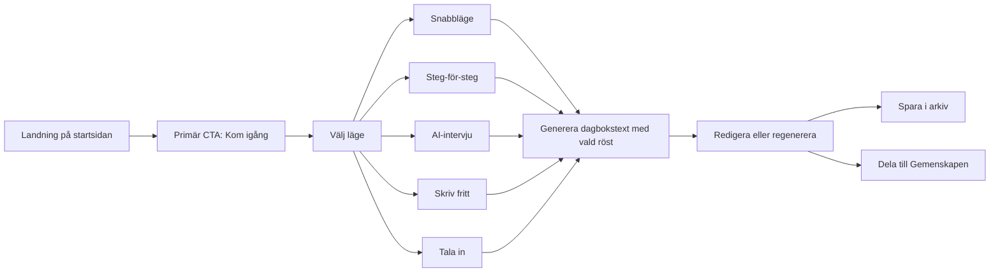

# Djupanalys av

## Sammanfattning för ledningen

Storify framstår som en tydligt positionerad, svenskspråkig AI-dagbok med ovanligt skarp copy, låg tröskel till första användning och en genomtänkt produktidé: hjälpa människor som **inte** redan har en dagboksvana att ändå dokumentera sina dagar. Produktsidan signalerar att tjänsten är gratis, kräver inget kreditkort och inte heller någon nedladdning av app, samtidigt som den erbjuder flera sätt att skapa innehåll, frivillig community-delning, kontobaserat arkiv och starka integritetslöften. Det är stark produktmarknadsföringslogik för en tidig konsumenttjänst. citeturn2view0turn5view0turn36search2turn45search1

Det som håller tillbaka sajten är inte idén utan affärs- och förtroendelagret. Det finns ingen tydligt exponerad juridisk företagsidentitet, ingen prissida eller uttalad monetiseringsmodell, inga kundomdömen eller pressomnämnanden på sajten, och flera viktiga produkterbjudanden presenteras inkonsekvent mellan startsida, Om-sida, guide och villkor. I praktiken känns Storify därför mer som ett starkt, ambitiöst hobby- eller indieprojekt än som ett fullt kommersialiserat SaaS-bolag. Det är inte nödvändigtvis dåligt, men det påverkar förtroende, konvertering och konkurrenskraft. citeturn5view0turn2view0turn24view0turn36search2turn45search1turn30search0

Min samlade bedömning är att Storify redan har ovanligt bra **produktpositionering** för sin storlek, men behöver tre saker snabbt för att växa: tydligare juridisk och kommersiell inramning, konsekvent dokumentation av vad produkten faktiskt innehåller, och mer synlig bevisföring i form av demo, skärmbilder, förtroendesignaler och mätbar SEO/konverteringsstruktur. Om de bitarna kommer på plats kan tjänsten bli en legitim nischvinnare på den svenska konsumentmarknaden för journaling och reflektion. citeturn2view0turn5view0turn24view0turn36search2turn45search1

## Affärsöversikt

På sajten beskriver Storify sig som en privat AI-dagbok på svenska, byggd för människor som inte orkar med den klassiska “blanka sidan”. Om-sidan säger uttryckligen att projektet är ett hobbyprojekt byggt av Johanna, 36, i entity["city","Göteborg","Göteborg, Västra Götaland, Sweden"], och att koden är öppen via ett publikt urlGitHub-repohttps://github.com/johannaefageras/storify. Det är en ovanligt transparent berättelse, men den innebär också att “företagsidentiteten” i traditionell mening är svagt specificerad: inget organisationsnummer eller juridiskt bolagsnamn exponeras tydligt i de granskade publika sidorna. citeturn5view0turn2view0

Erbjudandet är brett för att vara en tidig konsumentprodukt. Startsidan och Om-sidan beskriver fem vägar in i produkten — AI-intervju, Tala in, Snabbläge, Steg-för-steg och Skriv fritt — plus 32 olika “röster” som kan skriva användarens dag i olika tonaliteter. Guiden och de senaste villkoren beskriver samtidigt fyra lägen och 28 skrivstilar, samt funktioner som dagboksarkiv, kalender med streaks, badges, påminnelser, veckobrev, månadsbrev, PDF-export, delning till Gemenskapen och möjlighet att använda tjänsten även utan konto. Det betyder att Storify i produkttermer ligger nära en hybrid mellan dagboksapp, skrivassistent och lätt social publiceringsyta. citeturn2view0turn5view0turn36search2turn45search1

Värdeerbjudandet är mycket tydligt: “låg friktion”, “helt på svenska”, “ingen app att ladda ner”, “inget kreditkort”, och ett återkommande budskap om att användaren inte behöver vara duktig på att skriva för att få en bra dagbokstext. Privata anteckningar är standardläget, och man lovar också att texten inte används för att träna AI-modeller. Den kombinationen är stark, eftersom den avväpnar tre av de största invändningarna mot AI-journaling: ansträngning, språk och integritet. citeturn2view0turn5view0turn45search1

Affärsmodellen är däremot inte fullt uttalad. På det som faktiskt visas publikt är tjänsten gratis, och någon betalplan eller jämförelse mellan fria och premium-funktioner syns inte. Samtidigt finns flera kontobundna retention-funktioner — arkiv, streaks, badges, nyhetsbrev och community-koppling — som normalt hör hemma i en freemiumlogik. Det mest rimliga är därför att bedöma affärsmodellen som **produktledd freemium eller pre-pricing beta**, men just nu är monetiseringen publikt ospecificerad. citeturn2view0turn36search2turn45search1

| Dimension | Vad som kan verifieras | Bedömning |
|---|---|---|
| Identitet | Varumärket Storify används konsekvent, men juridisk bolagsidentitet är inte tydligt exponerad på de granskade sidorna. | Trovärdig berättelse, svag bolagsklarhet |
| Erbjudande | AI-dagbok på svenska med flera inmatningslägen, röster, konto/utan konto, arkiv och frivillig community. | Ovanligt rikt för en tidig produkt |
| Målgrupp | Personer som vill skriva dagbok men saknar tid, vana eller energi. | Tydligt avgränsad B2C-målgrupp |
| Prissättning | Gratis, inget kreditkort; betalmodell syns inte. | Bra för onboarding, otydligt för affär |
| Affärsmodell | Freemium/PLG verkar sannolik, men är inte explicit. | Ospecificerad offentligt |

Tabellen bygger på startsidan, Om-sidan, guiden och villkoren. citeturn2view0turn5view0turn36search2turn45search1

## Innehåll, budskap och SEO

Storifys största styrka är budskapet. Copytonen är kort, rolig, självsäker och lite anti-självhjälpsklyschig. Startsidans öppning — att användaren inte har tid att skriva dagbok, och att det är “perfekt” — sätter en tydlig konflikt direkt. Sajten säljer inte dagbok som plikt eller mindfulnessritual, utan som en snabb, smart lösning för verkliga människor med låg ork. Det är bättre positionering än många generiska journalingappar, eftersom det finns en skarp fiendebild: blank sida, höga krav, tidsbrist. citeturn2view0turn24view0

Call-to-actions är funktionella och logiska. “Kom igång” och “Logga in” finns tidigt, och resten av sidan bygger en tydlig väg från problem till lösning, vidare till produktlägen, röster, funktioner, integritet och slutlig CTA. Däremot saknas mellanliggande bevispunkter som “Se demo”, “Läs exempel”, “Jämför lägen” eller “Så ser en färdig text ut” i ett mer visuellt och konverteringsdrivet format. Budskapet är starkt; bevisföringen är svagare. citeturn2view0turn5view0

SEO-mässigt ser sajten lovande ut men inte färdigoptimerad. Titelsträngarna är rimliga, sidorna har tydliga H1:or, och bloggen bygger långsvans runt ämnen som dagboksskrivande, skrivblockering, integritet och AI som skrivassistent. Bloggindexet visar 14 indexerade inlägg mellan 1 april och 2 maj 2026, alltså en ovanligt tät publiceringstakt för ett litet projekt. Om-sidan säger dessutom att bloggen är ny och inte tänkt som en “halvautomatiserad SEO-maskin”, vilket antyder en medveten editorial strategi snarare än ren sökordsdumpning. citeturn24view0turn5view0

Samtidigt finns tydliga inkonsekvenser som kan skada både förtroende och SEO. Startsidan/Om-sidan säger 32 röster och fem sätt att skriva; guiden/villkoren säger 28 skrivstilar och fyra lägen. Det gör att Google, användare och eventuella recensenter får olika bild av produkten beroende på vilken sida de landar på. För ett litet varumärke är sådan friktion onödigt dyr. citeturn2view0turn5view0turn36search2turn45search1

| Sida | Titel | H1 | Primär sökordsinriktning | Kommentar |
|---|---|---|---|---|
| Startsida | “Privat AI-dagbok som ställer frågor \| Storify” | “Du har inte tid att skriva dagbok.” | AI-dagbok, skriva dagbok, privat, svenska | Stark differentiering men lite mer emotionell än sökorienterad |
| Om | “Storify – Om” | “En privat AI-dagbok för oss som aldrig skriver dagbok” | AI-dagbok, dagbok på svenska, hobbyprojekt | Bra för varumärkesförståelse, svag för kommersiell trovärdighet |
| Guide | “Storify – Din AI-dagbok” | “Användarguide” | dagbok, snabbläge, AI-intervju, röster | Bra långsvans och feature-SEO |
| Blogg | “Blogg – Storify” | “Bloggen” | dagboksskrivande, integritet, AI, skrivtips | Aktiv content-motor med relevant ämneskluster |
| Villkor | “Storify – Din AI-dagbok” | “Användarvillkor” | navigations-/legalsökningar | Fungerar, men bidrar inte till acquisition |

Meta descriptions kunde inte verifieras direkt i tillgänglig HTML-hämtning och bör därför betraktas som ospecificerade i denna rapport. Tabellens underlag kommer från de publika sidtitlarna och de hämtade H1-/brödtextkällorna. citeturn2view0turn5view0turn24view0turn36search2turn45search1

| Inkonsekvens | Version A | Version B | Affärseffekt |
|---|---|---|---|
| Antal lägen | Fem vägar in, inklusive “Tala in” | Fyra lägen i guide och villkor | Skapar osäkerhet om produktomfång |
| Antal röster | 32 röster på startsida/Om | 28 skrivstilar i guide/villkor | Ger intryck av ofärdig eller osynkad dokumentation |
| Kontaktidentitet | Personlig story på Om-sidan | Mer generisk team-/supportton i nya villkor | Visar mognad, men behöver bli konsekvent |

Underlaget för jämförelsen ovan kommer från startsidan, Om-sidan samt de versioner av guide och villkor som indexerats under våren 2026. citeturn2view0turn5view0turn12search0turn12search1turn36search2turn45search1

## UX, design och teknisk grund

Informationsarkitekturen är stark därför att den är **uppgiftsstyrd**. Användaren får först ett problem, sedan en enkel modell för hur produkten fungerar, sedan valmöjligheter. Storify försöker inte förklara allt på en gång; den guidar. Det är särskilt bra för en produkt som kan upplevas ny eller märklig vid första anblicken. Sajten använder också sina “röster” som både funktion och branding, vilket gör att produktens mest originella del också blir dess tydligaste designminne. Den annoterade sidokartan ovan fångar huvuddelen av den logiken. citeturn2view0turn5view0

Följande flöde sammanfattar den användarresa som sajten själv beskriver. citeturn2view0turn36search2turn45search1

Visuell branding är distinkt utan att vara överdesignad. Språket är den viktigaste designkomponenten: “Martyren”, “Cynikern”, “Livscoachen”, “Katten”, “Shakespeare” och liknande röster bygger personlighet och igenkänning. Det gör att Storify känns mer kulturellt och språkligt lekfull än konkurrenter som främst säljer säkerhet, statistik eller mindfulness. Nackdelen är att lekfullheten ännu inte fullt balanseras av institutionella trust-signaler. citeturn2view0turn5view0turn36search2

Mobilresponsivitet kan inte fullt verifieras i den här miljön med pixel- eller breakpoint-test, men flera signaler talar för ett mobilnära användningsfall: tjänsten ska kunna installeras direkt i webbläsaren som webbapp, har snabba lägen, “Tala in”, enstegsflöden och daglig användning med påminnelser. Accessibility-grunder som kontrastförhållanden, fokusordning och alt-texter kunde däremot inte kontrolleras direkt från de tillgängliga textkällorna och bör därför betraktas som ospecificerade i denna rapport. citeturn5view0turn36search2

Tekniskt är den mest robusta slutsatsen att Storify är en specialbyggd webbapp, inte ett tydligt CMS-bygge. Det stöds av att produkten är öppen källkod enligt Om-sidan, att den är installabel via webbläsaren, och att villkoren namnger flera konkreta drift- och tjänsteleverantörer för AI, backend, e-post, inloggning, geodata, väder och rate limiting. Däremot kunde varken hostingleverantör, CDN, desktop/mobile-PageSpeed eller publika Core Web Vitals verifieras säkert i de tillgängliga publika källorna, så de markeras som ospecificerade. Det är bättre att vara ärlig än att leka gissningslek med servermagi. citeturn5view0turn45search1

| Teknisk dimension | Verifierat | Bedömning |
|---|---|---|
| SSL/HTTPS | Sajten laddas över HTTPS | Ja, grundläggande transportskydd syns |
| Apptyp | Installabel webbapp i webbläsaren | Stark signal om PWA-liknande upplägg |
| AI-leverantör | urlAnthropichttps://www.anthropic.com | Hög säkerhet; uttryckligen namngiven |
| Auth/databas/arkiv | urlSupabasehttps://supabase.com | Hög säkerhet |
| E-postutskick | urlResendhttps://resend.com | Hög säkerhet |
| Inloggning/platstjänster | urlGooglehttps://www.google.com | Hög säkerhet |
| Väderdata | urlSMHIhttps://www.smhi.se | Hög säkerhet; svensk källa |
| Rate limiting/missbruksskydd | urlUpstashhttps://upstash.com Redis | Hög säkerhet |
| Kontaktformulär | Kontaktformulärstjänst nämns i villkoren | Namngiven i villkoren, men ej vidare verifierad här |
| CMS | Ospecificerat | Troligen custom-byggt |
| Hosting/CDN | Ospecificerat | Ej verifierbart från tillgängliga källor |
| Desktop/mobile speed | Ospecificerat | Ingen säker PSI/CrUX-verifiering i denna genomgång |
| Core Web Vitals | Ospecificerat | Samma begränsning som ovan |

Underlaget för tabellen kommer främst från Om-sidan och de senaste villkoren. citeturn5view0turn45search1

## Konvertering, marknadsföring och extern trovärdighet

Storify har en bra **aktiveringsmotor** men en svag **kommersiell motor**. Aktiveringen är enkel: gratis, snabb, på svenska, låg tröskel, ingen nedladdning, inget kreditkort. Det gör det lätt att börja. Men för någon som inte redan är helt såld saknas flera klassiska konverteringshjälpmedel: tydlig pricing, skärmdumpar av färdigt resultat, testimonials, presscitat, jämförelse mot alternativ, eller en konkret “varför nu?”-signal. Det är ett onboardingvänligt men ännu inte fullt säljande upplägg. citeturn2view0turn5view0

Lead capture och retention finns däremot på produktsidan. Konton kan skapas med e-post/lösenord eller Google-inloggning, inloggade användare får arkiv, kalender, streaks, badges och inställningar för veckobrev och månadsbrev, och villkoren nämner också en särskild kontaktformulärstjänst. Det betyder att Storify redan har grunderna för livscykelmarknadsföring, även om det inte är särskilt synligt som marknadsföring på startsidan. citeturn36search2turn45search1

Sajten har en tydlig organisk innehållsstrategi genom bloggen. Ämnena rör dagboksskrivande, problemsolving, skrivblockering, integritet, AI som skrivassistent och hur man faktiskt får en vana att hålla i. Det är smart, därför att innehållet ligger nära användarintentioner snarare än breda wellness-floskler. Om rätt internt länkat och optimerat kan bloggen bli Storifys viktigaste acquisition-kanal. Just nu ser den dock mer ut som en lovande motor än som en fullt instrumenterad SEO-maskin. citeturn24view0turn5view0

När det gäller analytics, tracking pixels och paid ads är bilden oklar. Cookiepolicy är länkad från sajten, men kunde inte hämtas direkt i denna miljö, och de senaste villkoren namnger flera driftleverantörer men inga tydliga analytics- eller annonsplattformar som GA4, Meta Pixel eller TikTok Pixel. Därför måste trackingstack och betald annonsering klassas som ospecificerade i publik evidens. Det betyder inte att spårning saknas; bara att den inte gick att verifiera säkert här. citeturn2view0turn45search1

Extern trovärdighet är just nu begränsad. På sajten syns inga kundomdömen, inga betyg, inga presslogos och inga case. Däremot finns två starkare positiva signaler: en aktiv blogg och ett publikt open-source-spår via GitHub. För en del användare — särskilt tekniskt lagda eller integritetsmedvetna — är det bra. För bredare konsumentpublik räcker det sannolikt inte; där behövs mer övertygande social proof. citeturn2view0turn5view0turn24view0

| Signal | Vad som kan verifieras | Tolkning |
|---|---|---|
| Recensioner/testimonials | Inga synliga på startsidan | Svag social proof |
| Press / media | Inga verifierbara pressomnämnanden i de granskade källorna | Låg extern auktoritet just nu |
| Social närvaro | GitHub-repo länkas från Om-sidan | Bra för transparens, svag för mainstream-förtroende |
| Företagsregistrering | Ingen tydlig juridisk identitet synlig på sajten | Behöver stärkas |
| Juridisk mognad | Nya villkor i april 2026 är mer detaljerade än februari-versionen | Positiv professionalisering |

Sökningar i urlAllabolaghttps://www.allabolag.se gav en tydlig träff på det orelaterade bolaget “Storify Publishing AB”, vars verksamhet gäller bokutgivning och författartjänster, inte AI-dagbok. Det stärker slutsatsen att mystorify.se:s juridiska bolagskoppling inte gick att verifiera tydligt i denna granskning. Källan anger själv att uppgifterna hämtas från bland annat SCB, urlBolagsverkethttps://bolagsverket.se och Skatteverket. citeturn30search0turn30search3turn5view0turn2view0

## Konkurrentlandskap i Sverige

Det närmaste konkurrensfältet i entity["country","Sverige","Nordic country in Europe"] är inte främst andra svenska AI-dagböcker, utan journaling-, humör- och reflektionsappar som är tillgängliga för svenska användare via officiella sajter och appbutiker. I denna jämförelse utgår jag från urlDay Oneturn39search1, urlDaylio Dagbok, Journal & Humörturn46search0, urlDagbok från Appleturn41search9, urlDeerly: Tacksamhetsdagbokturn41search0 och urlMindHappy - Tacksamhetsdagbokturn41search3. citeturn39search1turn46search0turn41search9turn41search0turn41search3

| Produkt | Kärnerbjudande | Svensk tillgänglighet | Prissättning som kunnat verifieras | Kommentar mot Storify |
|---|---|---|---|---|
| Storify | AI-genererad dagbok på svenska, flera lägen, röster, frivillig community | Ja, helt på svenska | Gratis, inget kreditkort; betalplan ospecificerad | Starkast i svensk språkposition och kreativ AI-tone-of-voice |
| Day One | Fullfjädrad dagbok med media, synk, kryptering och AI i högre nivåer | Ja, svensk App Store + webb | Basic gratis; Silver 49,99 USD/år; Gold 74,99 USD/år | Djupast premiumprodukt, mer mogen, mindre lekfull |
| Daylio Dagbok, Journal & Humör | Humörspårning, mikrodagbok, statistik, vanor, integritetslås | Ja | Gratis; köp i app, bl.a. 59 kr, 199 kr, 299 kr, 399 kr och 699 kr i svensk App Store | Stark på mående/vanor, svagare på narrativ och språkpersonlighet |
| Dagbok från Apple | Gratis iOS-journaling med förslag, media och iCloud-ekosystem | Ja för Apple-användare | Gratis | Svår gratis-konkurrent på iPhone, men inte AI-skribent på samma sätt |
| Deerly | Tacksamhetsdagbok med trädvisualisering, AI-insikter och affirmationer | Delvis; listad i svensk App Store men engelskspråkig | 129 kr/mån, 799 kr/år | Konkurrerar mer i self-care/tacksamhet-nisch än i fri narrativ dagbok |
| MindHappy | Tacksamhetsdagbok med reflektion och premiumfunktioner | Ja | Gratis bas; bl.a. 109 kr/mån, 225–659 kr/år, livstid 1 795 kr | Nischad gratitude-konkurrent, mindre kreativ än Storify |

Källor till tabellen: citeturn2view0turn39search1turn46search0turn41search9turn41search0turn41search3turn15search2

Jämfört med dessa alternativ har Storify tre tydliga konkurrensfördelar. För det första är språkpositionen bättre: tjänsten är byggd för svenska, inte bara översatt. För det andra är outputsidan mer kreativ: 28–32 röster och AI-genererad prosatext är en annan upplevelse än ren mood tracking eller tacksamhetsinmatning. För det tredje är friktionen låg även utan konto. Nackdelen är att konkurrenterna generellt är bättre på förtroendesign, paketerad premiumlogik, publicerad prissättning och teknisk mognad i marknadsföringen. citeturn2view0turn5view0turn36search2turn45search1turn39search1turn46search0turn41search9turn41search0turn41search3

## Prioriterade rekommendationer

Nedan är de åtgärder som sannolikt ger mest effekt snabbast. Jag har prioriterat sådant som både minskar förtroendefriktion och ökar förutsättningarna för organisk tillväxt och konvertering. citeturn2view0turn5view0turn24view0turn36search2turn45search1

| Prioritet | Åtgärd | Varför | Insats | Effekt |
|---|---|---|---|---|
| Hög | Lägg till tydlig juridisk identitet i footer/Om/Kontakt | Idag är bolags-/org.nr-lagret svagt eller ospecificerat, vilket bromsar förtroende | Låg | Hög |
| Hög | Synka produktspråket mellan alla sidor | 4 vs 5 lägen och 28 vs 32 röster skapar onödig osäkerhet | Låg | Hög |
| Hög | Publicera tydlig status för affärsmodell | Om tjänsten är gratis beta, säg det. Om premium kommer, säg vad som är planen | Låg | Hög |
| Hög | Lägg till visuella produktbevis på sajten | Fler riktiga exempel, skärmbilder, före/efter-exempel och demo minskar tröskeln kraftigt | Medellåg | Hög |
| Hög | Bygg ett tydligt trust block | Lägg till integritetsöversikt, hur data hanteras, vem som bygger tjänsten, kontaktvägar, changelog och ev. open-source-cred | Medellåg | Hög |
| Medel | Gör bloggen till en riktig SEO-hub | Skriv kluster kring “AI-dagbok på svenska”, “skriva dagbok utan konto”, “dagbok med frågor”, “dagbok för stressade” | Medel | Hög |
| Medel | Implementera och dokumentera analytics med samtycke | Idag är trackingstacken ospecificerad utåt; mätning behövs men bör vara transparent | Medel | Medel |
| Medel | Publicera tillgänglighets- och prestandaåtaganden | Accessibility statement och Lighthouse-budget ger mognadssignal och bättre kvalitet | Medel | Medel |
| Medel | Skapa tydligare e-post- och community-loopar | Vecko-/månadsbrev nämns, men bör paketeras tydligare som retention- och referralsystem | Medel | Medel |
| Låg | Lägg in jämförelsesida mot stora alternativ | “Storify vs Day One / Daylio / Apple Dagbok” kan ge högt intent-organiskt sök | Medel | Medel |

Rekommendationerna bygger främst på observerade gap i juridisk tydlighet, innehållskonsistens, visualisering, kommersiell transparens och social proof. citeturn2view0turn5view0turn24view0turn36search2turn45search1turn39search1turn46search0turn41search9turn41search0turn41search3

Min raka slutsats är denna: Storify har redan en bättre idé än många större dagboksappar, men sajten säljer idag främst **potentialen** i produkten, inte fullt ut dess **bevisade trygghet och mognad**. Om ambitionen är att förbli ett charmigt indieprojekt fungerar det nuvarande läget ganska bra. Om ambitionen är att bli ett starkt svenskt konsumentvarumärke måste sajten bli mer konsekvent, mer verifierbar och mer övertygande för någon som inte redan är förälskad i konceptet. citeturn2view0turn5view0turn24view0turn36search2turn45search1

## Öppna frågor och begränsningar

Vissa delar kunde inte verifieras säkert i tillgängliga publika källor och markeras därför som ospecificerade snarare än uppskattade: exakt hosting/CDN, publika Core Web Vitals för desktop/mobile, analytics-/pixelstack, cookieimplementation, detaljnivå på accessibility som kontrast/alt-texter, samt entydig juridisk företagsregistrering kopplad just till mystorify.se. Det är med andra ord luckor i den offentligt verifierbara evidensen, inte nödvändigtvis luckor i själva produkten. citeturn2view0turn5view0turn45search1turn30search0turn30search3